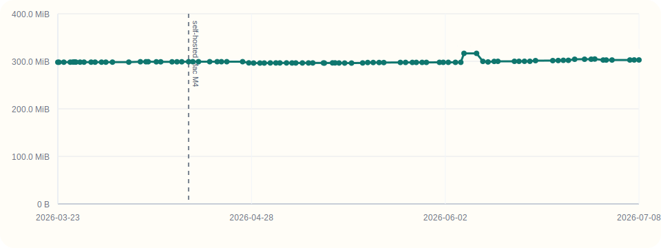
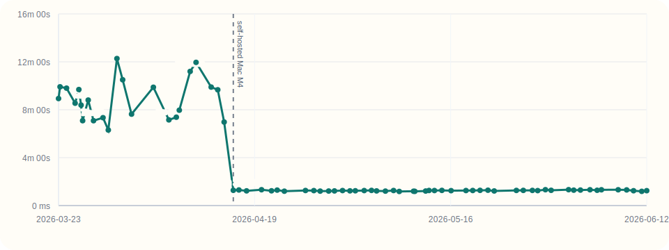
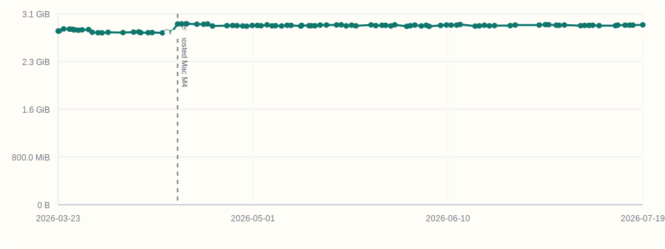
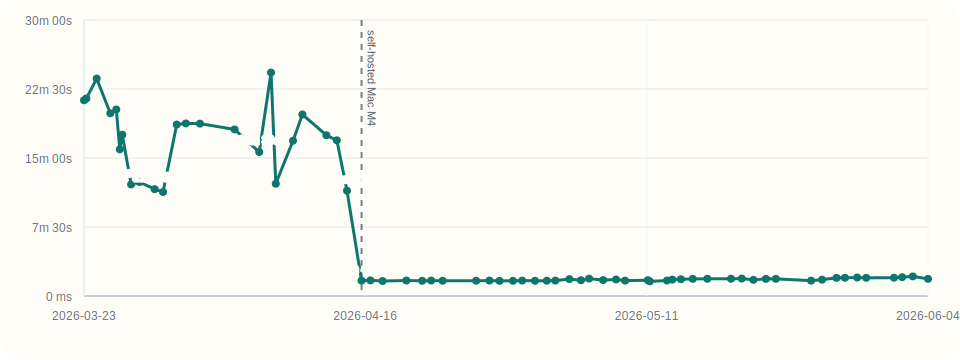
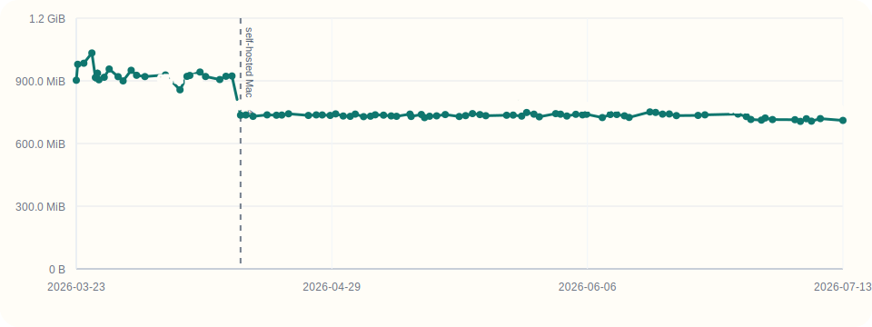

# Editor Metrics

Nightly Defold editor benchmarks tracked by Defold commit metadata.

Last updated: `2026-03-27T04:01:52Z`

## Run

```shell
python scripts/ci.py --workflow Nightly --event workflow_dispatch --input editor_sha=${SHA} --input commit_to_default_branch=true
```

## Charts

### Install size



### Open time



### Memory after open



### Build time



### Memory added by build


